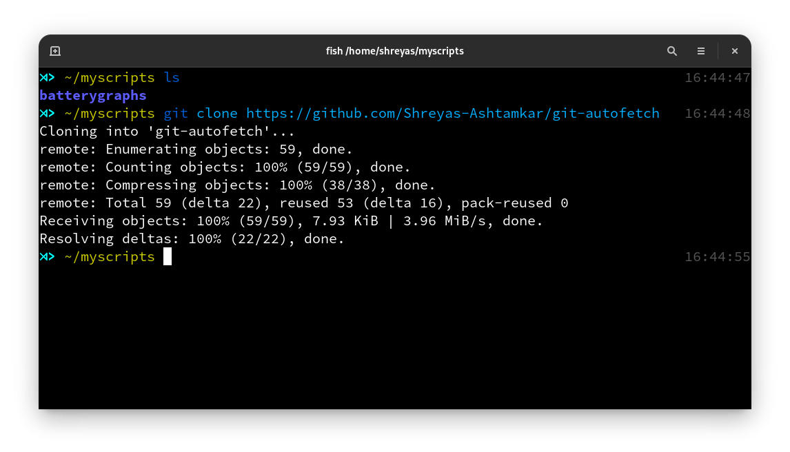
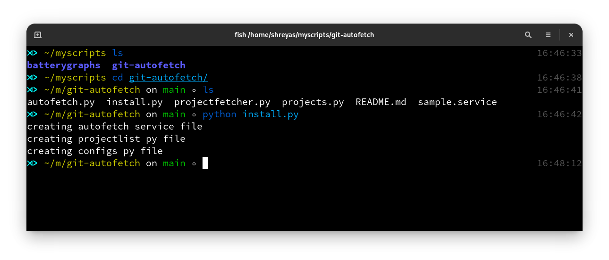
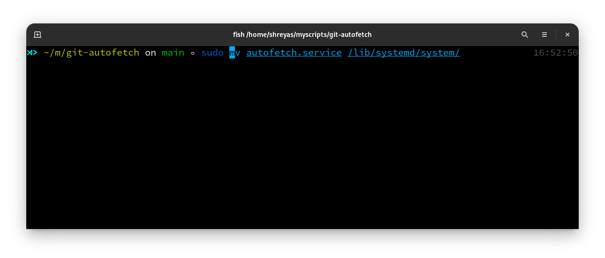
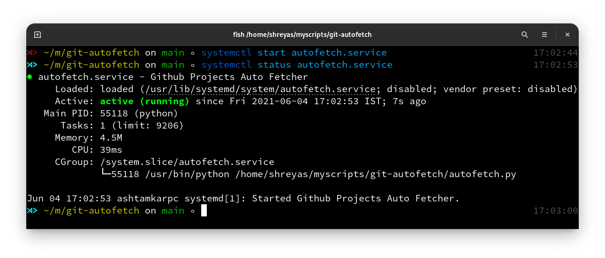

# Git Autofetch
Git Autofetch is a simple software for fetching new changes from a repo to local repositories after a set time interval. 

This program is responsible for checking the remote repo for changes and updating the local copy of the repo after a set delay (can be set in configs file later)

## INSTALLATION
1. Clone this repo.
    

2. cd into the repo
    

3. Run the install.py. This is important to create important files, and create paths dynamically.

    run `python3 install.py`
    
    This will create 3 files which are :
    |S. No|File Name|Purpose|
    |:---:|:--------|:------|
    |  1  |`configs.py`|Basic Configuration (Delay)|
    |  2  |`projectlist.py`|To store the list of projects to update (local folder path)|
    |  3  |`autofetch.service`|Service file to tell systemd to run our program in background|

    

4. Register Projects in the newly created projectlist.py
    
    For registering projects, you are required to add a [_Project](projects.py) object<sup>[1](#one)</sup> in the PROJECT_LIST<sup>[2](#two)</sup>, which will be available in projectlist.py file. You can give `name`, `url` and local `path` of the project as parameters to object. 

    <small><a name="one">1</a>. To create objects the syntax is as follows :
    ```python
        _Project(
            path=/path/to/git/project/folder
        ),
    ```
    <a name="two">2</a>. Do remember to add a comma after previous _Project object, or else it will give errors. [see below image `line:7`]
    </small>
    
    

5. Move the newly created autofetcher.service to systemd's folders.
    
    run `sudo mv autofetch.service /lib/systemd/system/`
    

6. Reload the systemd daemon.
    
    run `sudo systemctl daemon-reload`
    

7. Start the service autofetcher.service

    run `sudo systemctl start autofetcher`

    

8. Check the status of autofetcher service

    run `sudo systemctl status autofetcher`
    

8. (optional) Enable the service autofetcher

    run `sudo systemctl enable autofetcher`

And you will have your autofetcher running.

---
## ISSUES
In case of issues, please open an issue.
Describe the following :
1. Which OS are you trying this on ? (Windows\Mac\Linux)
2. Steps you followed
3. Run step 8, attach screenshot of errors
